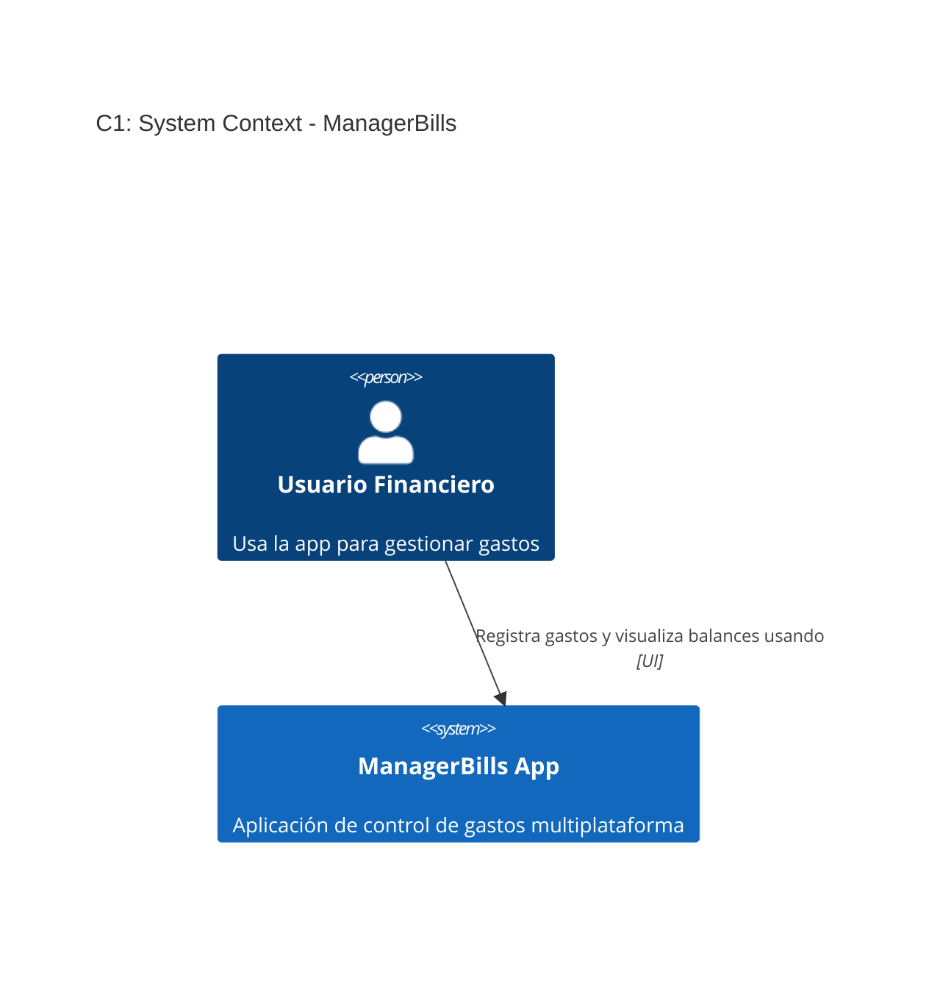
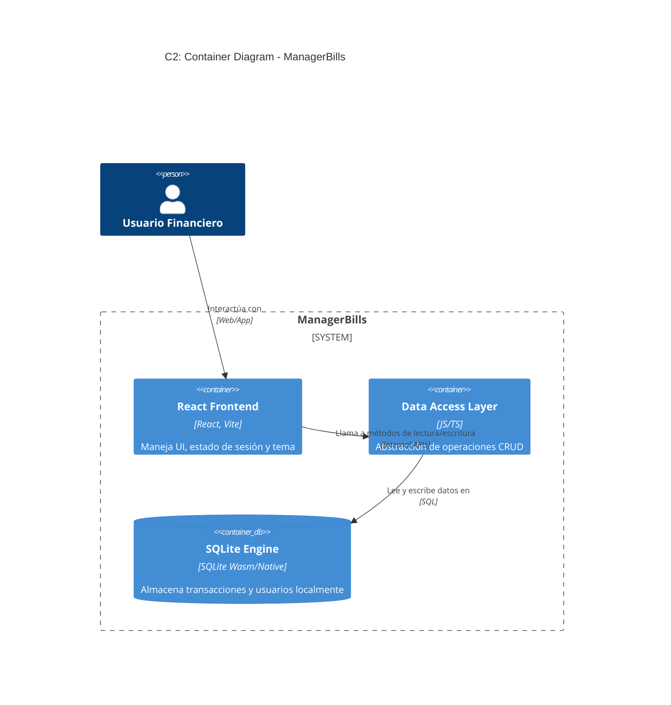
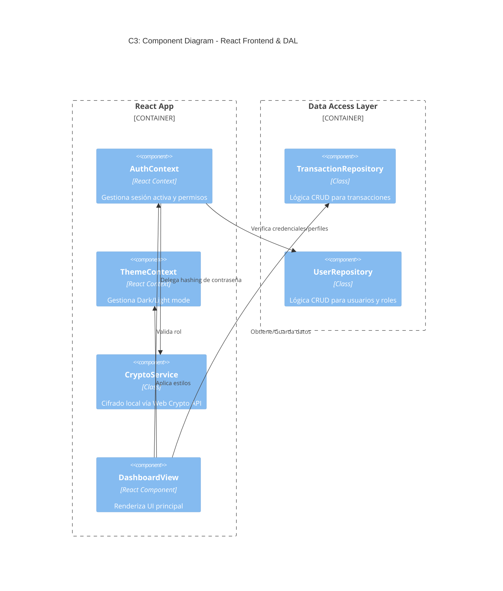

# Blueprint E2E - ManagerBills

## 1. Visión del Producto
Aplicación de Registro de Ingresos/Gastos omnicanal (Web, Desktop, Mobile) que permite a múltiples usuarios y roles registrar transacciones, categorizarlas y proveer un resumen mensual con soporte para modo oscuro/claro y persistencia robusta offline en SQLite.

## 2. Requerimientos Funcionales (Core)
- **Gestión de Usuarios**: Autenticación local, perfiles y roles (Admin, Editor, Lector).
- Registro de transacciones vinculadas a un usuario específico.
- Sistema de categorización.
- Resumen mensual mostrando totales y balance.
- **Tematización**: Interfaz con modo claro y oscuro seleccionable.

## 3. Requerimientos No Funcionales (NFRs)
- Almacenamiento local en SQLite para relaciones complejas (Usuarios <-> Transacciones).
- UI/UX responsive.
- Arquitectura basada en React, lista para compilar a Web, Desktop (Windows) y Mobile.

## 4. Audiencia y Casos de Uso
- Familias o equipos pequeños llevando finanzas compartidas.
- Casos de uso: Un Lector revisa el balance mensual; un Editor agrega gastos en modo oscuro por la noche.

## 5. Diseño UX/UI (Sistema de Diseño Visual)
- **Estética**: Diseño glassmorphism.
- **Modos de Color**: Implementación de Design Tokens para Dark Mode y Light Mode.
- **Tipografía**: 'Inter' o 'Roboto'.
- **Componentes Core**: Selector de perfiles (Login local), modal/formulario de transacción, toggle de tema solar/lunar.

## 6. Diagrama de Flujo de Usuario
- `Login` -> `Seleccionar Perfil` -> `Home`.
- `Home` -> `Ajustes` -> `Cambiar a Modo Oscuro`.
- `Home` -> `[+] Nueva Transacción` -> `Verificación de Rol` -> `Guardar`.

## 7. Arquitectura del Sistema (C1)

## 8. Arquitectura de Contenedores (C2)

## 9. Componentes Principales (C3)

## 10. Tech Stack
- Frontend: React (Vite).
- Estilos: TailwindCSS.
- Routing: React Router (`react-router-dom@7`) para navegación entre vistas y guards de sesión (HU-008).
- Persistencia: SQLite vía `sqlocal@0.18.0` (OPFS + Wasm en el navegador), plugin nativo para escritorio.
- Empaquetado Futuro: Tauri / Capacitor.

## 11. Estructura de Datos / Modelo (SQLite Schema)
- `Roles (id TEXT PK, name TEXT, permissions TEXT)` — modela los 3 roles base (Admin/Editor/Lector) como filas, no como enum; soporta roles custom (HU-007 Scenario 5) sin cambio de esquema, ya que `permissions` es un set arbitrario asociado a cualquier fila nueva.
- `Users (id TEXT PK, username TEXT, role_id TEXT FK, avatar_url TEXT, theme_preference TEXT, password_hash TEXT)`
- `Categories (id TEXT PK, name TEXT, type TEXT)`
- `Transactions (id TEXT PK, user_id TEXT FK, type TEXT, amount REAL, date TEXT, category TEXT, description TEXT)`

## 12. Decisiones Arquitectónicas (ADRs)

### ADR 001: Arquitectura Multiplataforma con React y SQLite
- **Estado**: Aceptado
- **Contexto**: Se requiere llegar a Desktop, Web y Mobile sin mantener 3 bases de código.
- **Decisión**: Usar React como core UI y abstracciones para SQLite (Wasm en web, nativo en Tauri/Capacitor).
- **Alternativas Consideradas**: Flutter (descartado: el equipo no tiene experiencia en Dart y perdería reuso de componentes web existentes); apps nativas separadas por plataforma (descartado: triplica el esfuerzo de mantenimiento).
- **Consecuencias**: Garantiza 90% reuso de código; complejidad en las capas de adaptador de BD según plataforma.

### ADR 002: Manejo Local de Autenticación
- **Estado**: Aceptado
- **Contexto**: App offline necesita varios roles.
- **Decisión**: Implementar "Selección de Perfil" validado contra SQLite local.
- **Alternativas Consideradas**: Autenticación contra servidor remoto (descartado: rompe el requisito de funcionamiento 100% offline).
- **Consecuencias**: Sin servidor central; el dispositivo es el perímetro de confianza físico.

### ADR 003: Hashing de Contraseñas y Migraciones en OPFS
- **Estado**: Aceptado
- **Contexto**: Requerimiento de autenticación segura (HU-009) en un ecosistema offline.
- **Decisión**: Utilizar Web Crypto API (PBKDF2 con SHA-256) nativa del navegador para generar hashes. Para instalaciones existentes (v1.0.0), el arranque de la app disparará un script `ALTER TABLE users ADD COLUMN password_hash TEXT`, y forzará al usuario a establecer una clave en el primer login.
- **Alternativas Consideradas**: bcrypt vía librería externa (descartado: agrega dependencia pesada para un cálculo que Web Crypto API ya cubre nativamente).
- **Consecuencias**: Garantiza seguridad local sin dependencias externas pesadas. Riesgo de pérdida de cuenta si el usuario olvida su clave.

### ADR 004: React Router para Navegación y Guards de Sesión
- **Estado**: Aceptado
- **Contexto**: HU-008 requiere navegación entre vistas (Dashboard, Usuarios, Configuración) y bloqueo de rutas según rol/sesión (HU-007 Scenario 3, HU-009).
- **Decisión**: Usar `react-router-dom@7` con rutas anidadas y un componente guard que consulta `AuthContext` antes de renderizar rutas protegidas.
- **Alternativas Consideradas**: Enrutamiento manual vía estado de React (descartado: reimplementa historial, guards y rutas anidadas que React Router ya resuelve).
- **Consecuencias**: Navegación declarativa estándar; acoplamiento a la API de React Router para futuras migraciones de framework.

## 13. Seguridad y Privacidad
- La autenticación se verifica a nivel local.
- Componentes UI ocultan acciones sensibles según el `role_id` actual inyectado vía Context.

## 14. Estrategia de Testing (QA)
- Pruebas de integración sobre repositorios SQLite.
- Component Testing para la UI usando React Testing Library.

## 15. Orden de Construcción (Plan de Build)
1. **Fase 1**: Configurar Vite + React + Contexto de Temas (Claro/Oscuro).
2. **Fase 2**: Configurar SQLite con tablas de Roles y Usuarios.
3. **Fase 3 (EP-001)**: Implementar pantalla de Perfiles (HU-001), `AuthContext` y autenticación segura (HU-009), Onboarding (HU-010), navegación con React Router (HU-008) y Panel de Gestión de Usuarios/Roles (HU-007).
4. **Fase 4**: Migrar prototipo UI a React.
5. **Fase 5 (EP-002)**: Implementar CRUD de Transacciones y gestión de Categorías (HU-011).
6. **Fase 6 (EP-003)**: Implementar Dashboard y Resumen Mensual.
